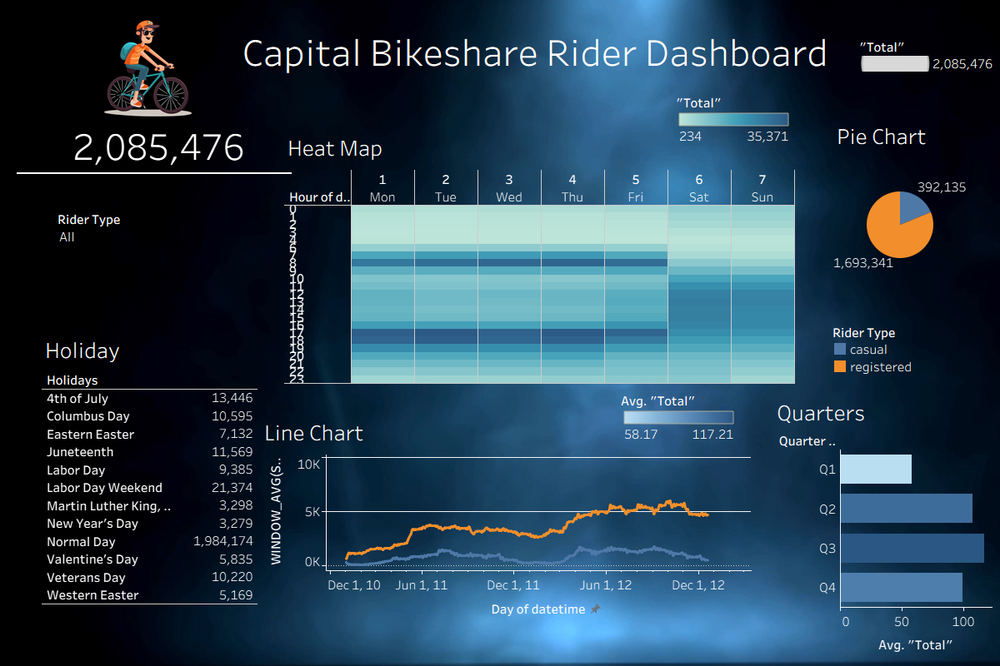
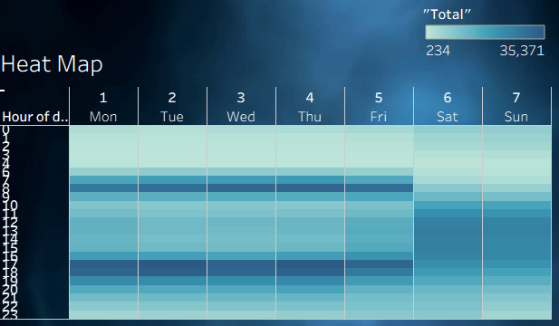
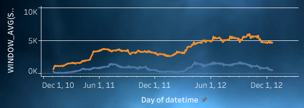
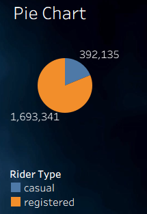
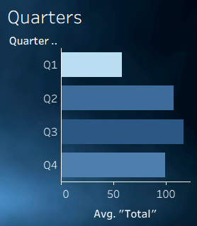
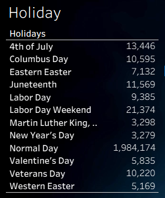

# Guided Biker Tableau Project

Author: Marcus Hollimon

Version: 3.13

Credit for tutorial: https://www.youtube.com/watch?v=ct3fuxF_NuA

Purpose: This is my first time using Tableau, and I wanted to gain some experience with these powerful data visualization tools.

Interactive dashboard on Tableau Public: https://public.tableau.com/views/bike_share_dashboard_17915718112610/CapitalBikeshareRiderDashboard

## Description

This is a Tableau dashboard built on two years (2011 and 2012) of hourly bike share rentals. It shows how many rides there were, who was riding (casual or registered riders), what times of day and days of the week were busiest, how ridership changed across the year, and how holidays compare to normal days.

I followed the tutorial linked above to build it, then went back through the data and fixed a duplicate row problem (see Data Fix below).

## Dataset

- Source: Kaggle's Bike Sharing Demand data (https://www.kaggle.com/competitions/bike-sharing-demand), which comes from Capital Bikeshare in Washington, DC.
- Each row is one hour, with weather info and the number of casual, registered, and total riders.
- It only covers days 1 through 19 of each month, so monthly and yearly totals are not full months or full years.
- `bike_share_data_clean.xlsx` has a "year 2011" sheet (5,422 rows) and a "year 2012" sheet (5,464 rows). Tableau unions the two sheets.
- The union is left joined on date to a US Holiday Dates (2004-2021) CSV so each day can be labeled with its holiday name.

## Sheets

| Sheet | What it shows |
|---|---|
| KPI | Total rides across both years. |
| Pie Chart | Casual vs. registered riders. It also works as a filter for the Heat Map and Line Chart on the dashboard. |
| HeatMap | Total rides by hour of the day and day of the week. |
| Line Chart | Daily rides by rider type, smoothed with a 24-period moving average (`WINDOW_AVG(SUM(...), -24, 0)`). |
| Quarters | Average rides per hour for each rider type, by quarter (both years combined). |
| Holiday Table | Rides on each holiday, with every other day grouped as "Normal Day". |

Calculated fields:
- **Holidays**: the holiday name from the holiday CSV, or "Normal Day" if there isn't one.
- **Day of Week ABR**: the first three letters of the weekday (Mon, Tue, ...) for the heat map.
- **WINDOW_AVG**: the 24-period moving average used in the line chart.

| Heat Map | Line Chart |
|---|---|
|  |  |

| Pie Chart | Quarters |
|---|---|
|  |  |

| KPI | Holiday Table |
|---|---|
|  |  |

## Key Findings

All numbers are from the cleaned data and only include days 1 through 19 of each month.

- **2,085,476 total rides** across 2011 and 2012.
- **Ridership went up about 67% from 2011 to 2012**, from 781,979 rides to 1,303,497. Registered riders went up 70% (626,162 to 1,067,179) and casual riders went up 52% (155,817 to 236,318).
- **Registered riders made up 81% of all rides** (1,693,341), and casual riders made up 19% (392,135).
- **Weekday rides peak around commute times.** The three busiest weekday hours are 5 PM (169,368 rides), 6 PM (158,575), and 8 AM (151,760). The busiest single spot on the heat map is Tuesday at 5 PM with 35,371 rides.
- **Weekends peak in the middle of the day**, with 1 PM (51,991), 12 PM (50,832), and 2 PM (50,742) as the busiest hours.
- **Casual riders ride more on weekends**, about 60 rides an hour vs. 26 on weekdays. Registered riders go the other way, about 167 an hour on weekdays vs. 128 on weekends.
- **Summer and fall are the busiest.** Q3 (Jul-Sep) has the highest average at 117.2 rides per hour for each rider type, and Q1 (Jan-Mar) has the lowest at 58.2. June is the busiest month (220,733 rides) and January is the slowest (79,884).
- **Holidays were a small part of total ridership.** All the holidays in the Holiday table add up to 101,302 rides (about 4.9%), and normal days account for 1,984,174. Labor Day Weekend had the most (21,374), followed by 4th of July (13,446). The winter holidays had the fewest, with Martin Luther King Jr. Day at 3,298 and New Year's Day at 3,279. These totals cover both years, and only holidays that fell on days 1 through 19 of the month are included.

## Data Fix

When I went back through the data, I found that the "year 2011" sheet had 10,886 rows, but 5,464 of them were exact copies of the "year 2012" rows with the year changed to 2011. That made 2011 look like 2,085,476 rides (more than 2012) and pushed the KPI total up to 3,388,973. It made it seem like ridership went down in 2012, when it actually went up about 67%. I removed the copied rows so 2011 has its real 5,422 rows (781,979 rides).

This problem was already in the tutorial's data, so the dashboard in the video shows 3,388,973 total rides too, and its line chart drops off at the start of 2012. If you follow the tutorial, your numbers will match the video, not this dashboard.

- `bike_share_data_original.xlsx` is the data as I first used it.
- `bike_share_data_clean.xlsx` is the fixed data the dashboard uses.
- `scripts/remove_duplicate_2011_rows.py` is the script that made the clean file.

## How to Open the Workbook

1. Download `bike_share_dashboard.twbx` from this repo.
2. Open it in Tableau Public (free) or Tableau Desktop. The data is packaged inside the file, so you don't need to download anything else.
3. If you just want to look at it, use the Tableau Public link at the top.
